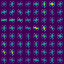

## Writeup Template
### You can use this file as a template for your writeup if you want to submit it as a markdown file, but feel free to use some other method and submit a pdf if you prefer.

---

**Vehicle Detection Project**

The goals / steps of this project are the following:

* Perform a Histogram of Oriented Gradients (HOG) feature extraction on a labeled training set of images and train a classifier Linear SVM classifier
* Optionally, you can also apply a color transform and append binned color features, as well as histograms of color, to your HOG feature vector. 
* Note: for those first two steps don't forget to normalize your features and randomize a selection for training and testing.
* Implement a sliding-window technique and use your trained classifier to search for vehicles in images.
* Run your pipeline on a video stream (start with the test_video.mp4 and later implement on full project_video.mp4) and create a heat map of recurring detections frame by frame to reject outliers and follow detected vehicles.
* Estimate a bounding box for vehicles detected.

[//]: # (Image References)
[image1]: ./examples/car_not_car.png
[image2]: ./examples/HOG_example.jpg
[image3]: ./examples/sliding_windows.jpg
[image4]: ./examples/sliding_window.jpg
[image5]: ./examples/bboxes_and_heat.png
[image6]: ./examples/labels_map.png
[image7]: ./examples/output_bboxes.png
[video1]: ./project_video.mp4

## [Rubric](https://review.udacity.com/#!/rubrics/513/view) Points
### Here I will consider the rubric points individually and describe how I addressed each point in my implementation.  

---
### Writeup / README

#### 1. Provide a Writeup / README that includes all the rubric points and how you addressed each one.  You can submit your writeup as markdown or pdf.  [Here](https://github.com/udacity/CarND-Vehicle-Detection/blob/master/writeup_template.md) is a template writeup for this project you can use as a guide and a starting point.  

You're reading it!

### Histogram of Oriented Gradients (HOG)

#### 1. Explain how (and identify where in your code) you extracted HOG features from the training images.

The code for this step is contained in visualize.py.

I started by reading in all the `vehicle` and `non-vehicle` images.  Here is an example of one of each of the `vehicle` and `non-vehicle` classes:

I then explored different color spaces and different `skimage.hog()` parameters (`orientations`, `pixels_per_cell`, and `cells_per_block`).  I grabbed random images from each of the two classes and displayed them to get a feel for what the `skimage.hog()` output looks like.

Here is an example using the `YCrCb` color space and HOG parameters of `orientations=9`, `pixels_per_cell=(8, 8)` and `cells_per_block=(2, 2)`:

# Car

# Not Car

#### 2. Explain how you settled on your final choice of HOG parameters.

I tried various combinations of parameters and found that 9 HOG orientations, with 8 pixels per cell and 2 cells per block performed well on my initial sample of 1000 images. So, I decided to stick with those parameters and train with all of the data.

#### 3. Describe how (and identify where in your code) you trained a classifier using your selected HOG features (and color features if you used them).

The code for this step is contained in classify.py and in line 53-101 of lesson_functions.py.

I trained a linear SVM using the vehicles and non-vehicle images provided for the class. After extracting HOG and color features, I then used `sklearn.preprocessing.StandardScaler` to normalize features.

I also used `sklearn.model_selection.train_test_split` to split the data into randomized training and test tests.

I wanted to use `predict_proba` to threshold data in my pipeline, so I also used `sklearn.calibration.CalibratedClassifierCV` while training my classifier.

My final test accuracy was 0.9907.

### Sliding Window Search

#### 1. Describe how (and identify where in your code) you implemented a sliding window search.  How did you decide what scales to search and how much to overlap windows?

The final code for this step is contained in lesson_functions.py (find_cars function, lines 283-349) and pipeline.py (run function, lines 49-62).

Initially, I experimented by running different scale sizes over the the lower half of the test images (test_images.py) and tested with different heat thresholds. From the output, I saw that the smaller scale (.5) worked best from about 400-464, but would pick up a lot of false positives in the rest of the image.

Ultimately, I picked the scale and overlap through trial and error.

I searched for small cars using a scale of .5 from 400-464, and I searched for larger cars with scale 1.5 and 2 from 400-656.

#### 2. Show some examples of test images to demonstrate how your pipeline is working.  What did you do to optimize the performance of your classifier?

I searched on three scales using YCrCb 3-channel HOG features plus spatially binned color and histograms of color in the feature vector, which provided a nice result.  Here are some example images:

### Video Implementation

#### 1. Provide a link to your final video output.  Your pipeline should perform reasonably well on the entire project video (somewhat wobbly or unstable bounding boxes are ok as long as you are identifying the vehicles most of the time with minimal false positives.)
Here's a [link to my video result](./project_output6.mp4)

#### 2. Describe how (and identify where in your code) you implemented some kind of filter for false positives and some method for combining overlapping bounding boxes.

The code for this is in pipeline.py (lines 64-78), and lesson_functions.py (find_cars function, lines 338-341).

I recorded the positions of positive detections in each frame of the video.  From the positive detections I created a heatmap and then thresholded that map to identify vehicle positions.  I then used `scipy.ndimage.measurements.label()` to identify individual blobs in the heatmap.  I then assumed each blob corresponded to a vehicle.  I constructed bounding boxes to cover the area of each blob detected.

Even after thresholding the heatmap, I still had several false positives. I ended up adding `sklearn.calibration.CalibratedClassifierCV` to my classifier which adds the `predict_proba` function to my model. I set a threshold of .85 for the classifier's probability. While this didn't completely remove all false positives, it did significantly reduce them.

Here's an example result showing the heatmap from a series of frames of video, the result of `scipy.ndimage.measurements.label()` and the bounding boxes then overlaid on the last frame of video:

### Here are six frames and their corresponding heatmaps:

###### Frame 1

###### Frame 2

###### Frame 3

###### Frame 4

###### Frame 5

###### Frame 6

### Here is the output of `scipy.ndimage.measurements.label()` on the integrated heatmap from all six frames:

### Here the resulting bounding boxes are drawn onto the last frame in the series:

---

### Discussion

#### 1. Briefly discuss any problems / issues you faced in your implementation of this project.  Where will your pipeline likely fail?  What could you do to make it more robust?

Initially, I ran into issues with trying to detect cars that were far away and ones that were up close. To fix this, I tested with several different scales and ultimately used 3 different windows to find cars.

I still have several false positives. My current implementation detects cars in the guard rails and in trees.
I would like to try out using a neural network for classification to see if this would have better accuracy.

Also, the pipeline is currently very slow. I may be able to adjust some of the windows so that it doesn't take as long to process.
